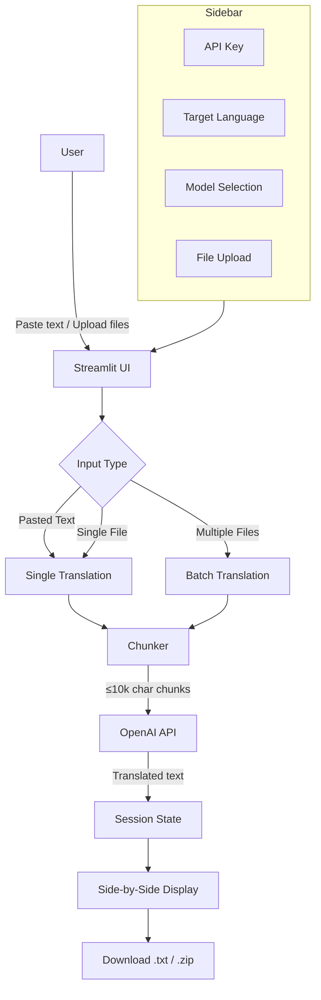
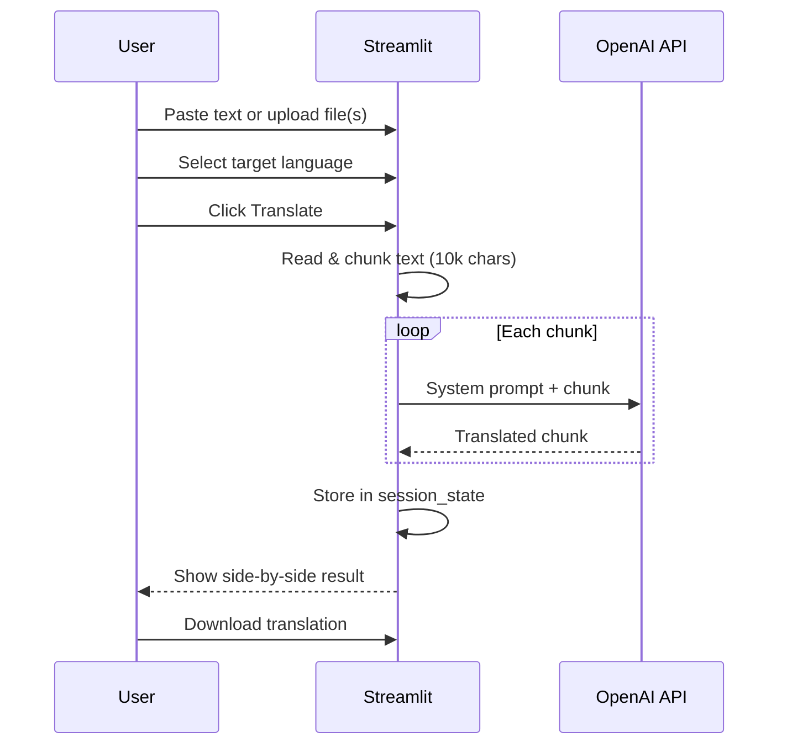

# 🔄 This-to-That

A local Streamlit app that translates mixed-language text (primarily Japanese → English) using OpenAI. Upload files or paste text — only the foreign-language parts get translated, everything else stays intact.

## Architecture



## Flow



## Setup

```bash
uv init --no-readme
uv add streamlit openai python-dotenv
```

Create a `.env` file:

```
OPENAI_API_KEY=sk-your-key-here
```

## Run

```bash
uv run streamlit run app.py
```

## Features

- Paste text or upload single/multiple files (json, txt, csv, md, xml, etc.)
- Translates only foreign-language parts, keeps target-language text untouched
- Side-by-side original vs translated view
- Download as `.txt` or `.zip` (multi-file) with `_english_translated` naming
- Persistent results across Streamlit reruns
- Configurable model (gpt-4o-mini default, gpt-4o, gpt-3.5-turbo)
